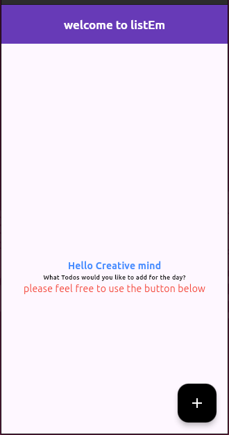
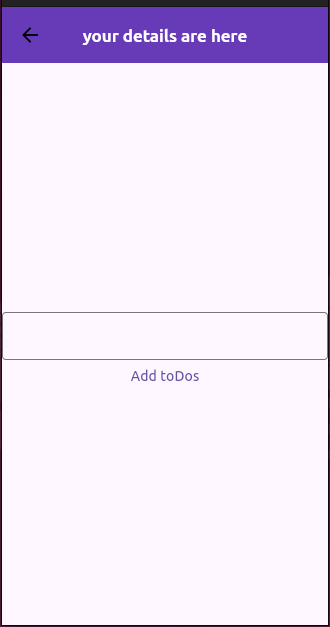
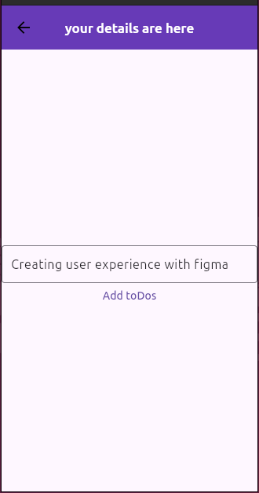
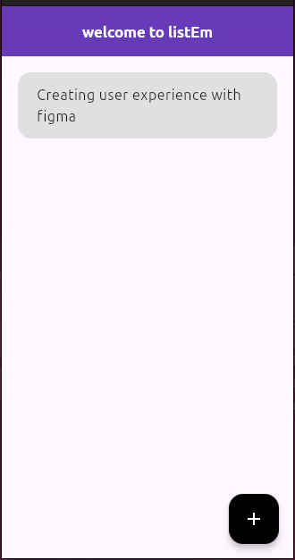
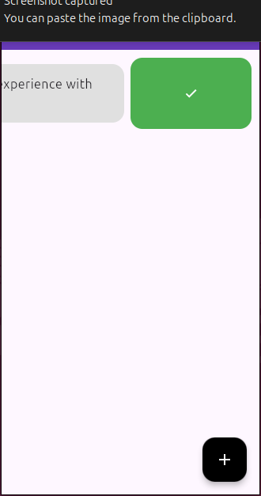
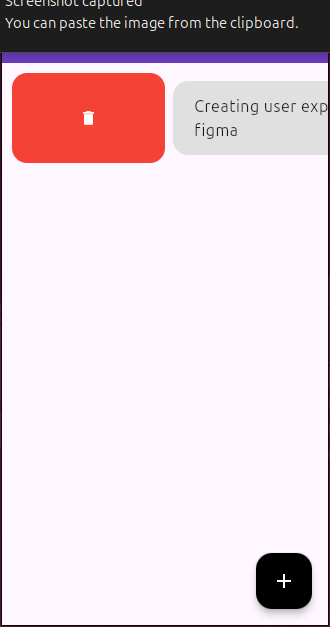
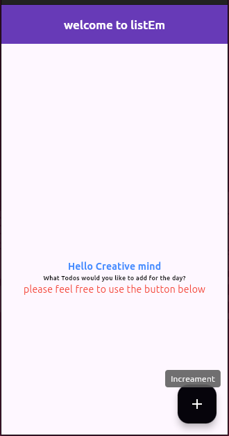
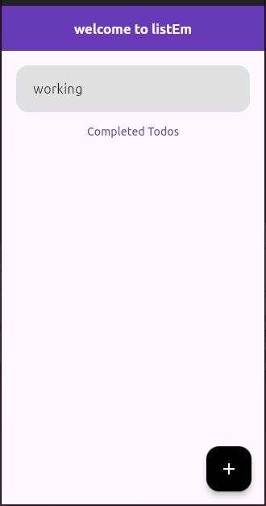
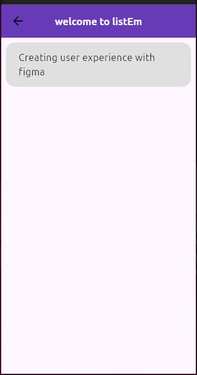

# Flutter Todo App
Listem App is a modern todo app I developed for myself
A simple and intuitive Todo application built with Flutter, utilizing the Riverpod state management library.

## Features

- **Add Tasks**: Users can easily add new tasks to their todo list.
- **Mark Tasks as Complete**: Users can mark tasks as complete, and the completed tasks will be visually distinguished.
- **Delete Tasks**: Users can remove tasks from their todo list.
- **Persistent Storage**: Tasks are stored locally on the device, ensuring data persistence even after the app is closed.
- **Responsive Design**: The app is designed to adapt to different screen sizes and orientations, providing a seamless user experience on both mobile and tablet devices.

## Technologies Used

- **Flutter**: A popular open-source mobile app development framework created by Google.
- **Riverpod**: A state management library that simplifies the management of application state in Flutter apps.
- **Slidable**: A simple fflutter file that let's you slide through the right or left of your screen

## Project Structure

The project follows a clean and modular architecture, with the following key components:

- `lib/`
  - `models/`: Defines the data models for todo items.
  - `pages` : Contains different pages and routes
  - `providers/`: Contains the Riverpod providers for state management.
  - `main.dart`: The entry point of the application.

## Getting Started

1. Clone the repository:
   <pre><code>
   git clone git https://github.com/sprucetonye/todos.git
   </code></pre>
2. CD into the file
    <pre>
    <code>cd todos</code>
    </pre>
3. Run ypur flutter app 
    <pre>
   <code>flutter run</code>
   </pre>
4. Screenshots of the App

  &nbsp;&nbsp;&nbsp;
  &nbsp;&nbsp;&nbsp;
  

  &nbsp;&nbsp;&nbsp;
  &nbsp;&nbsp;&nbsp;
  

  &nbsp;&nbsp;&nbsp;
  &nbsp;&nbsp;&nbsp;
  

